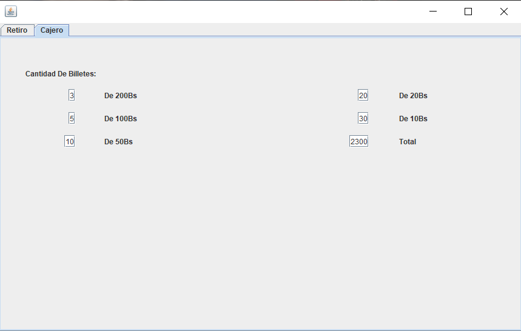
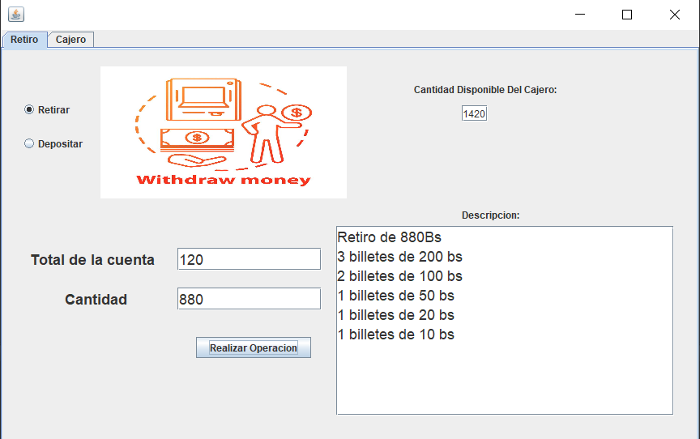
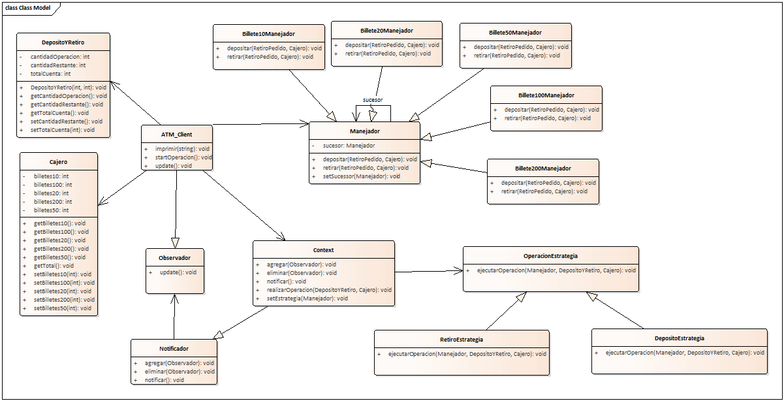

# Simulador De Cajero ATM Con Patrones De Diseño
[English](./README.md) | [Español](./README.es.md)

<p align="center">
  
</p>

Es un Simulador De Cajero ATM, que cuenta con 3 patrones de diseño: cadena de responsabilidad, estrategia y observador.

## Funciones Clave

- Puedes Retirar con restricciones a la cantidad que tienes en tu cuenta y en base a las fracciones de billetes que cuenta el cajero ATM.
- Puedes Depositar dinero a tu cuenta, aqui lo malo es que no se separa por fracciones de billetes que deseas depositar.
- Se puede agregar fracciones a cualquier billete.

## Requisitos Del Sistema

- Netbeans v8.2
- JDK 8

## Instalacion

1. Clona este repositorio en tu máquina local:

    ```bash
    git clone https://github.com/ElianHuanca/Simulador-De-Cajero-ATM.git
    ```
2. Entras a Netbeans, abres el proyecto y lo corres.

## Interfaces De Usuario

Echa un vistazo a algunas interfaces de usuario de la plataforma a continuación.

*Cajero*
<p align="center">
    
    <br>
    Aqui se visualiza la fraccion de cada billete que tiene el cajero
</p>

*Retiro*
<p align="center">
    
    <br>
    Aqui Puedes realizar la operacion de retiro o deposito
</p>

## Diagrama De Clase Dinamico


<p align="center">
    
</p>
