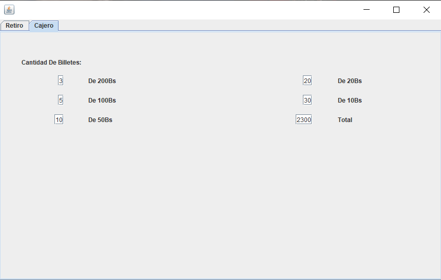
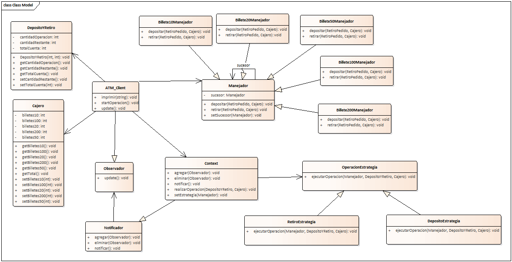

# ATM Simulator With Design Patterns
[English](./README.md) | [Español](./README.es.md)

<p align="center">
  <img loading="lazy" src="data:image/png;base64,iVBORw0KGgoAAAANSUhEUgAAAO8AAADTCAMAAABeFrRdAAAA81BMVEXl6+f///+ytLmHo4w0XG9ERkqvtLm4ur/u8+62t7xwg48yWm4nVWqlqrAuWWyvsbZAZHXY3ds9P0RMTlFkhH7v8PGfoKEqLDJ+nYSFhojz9/MzNjvV1tlfYWWQkpafr7O/ysoUS2JagIy9zNHd5eLj8fVji5Vuk53P4eZ8kpuSrLSntb1MbH2YpKvm7O7L19a70NaBn6nS3durv8GNqLFReIXAz86hsLjGyMzM2M+8y7+rvq/c6++Ws7uXr5t1jZdzlYFZd4WLnqgAOVQAQ1vBwsLQ0NGjvsa3x7qJpaKvwr9ofIl/n5xskYyftrRWeHppj4G2xd3lAAANcElEQVR4nO2deVvbuBaHLaDEKSFhqYtbaMlibHDAxstkaGmAMm3T6bTcfv9Pc2VnTyxZR4vR3Of+/uij6UCitzo6RzraDKRWQdwbDdPIW1KU+qNeHLxV/N1FMlR9sBUnqed60WkyiB0jk5krLxpx2B7/71EYqKpBoVTwWvHIcyO/HWeMBlEZvDM4jVzP71kKqlEo6byh73n+wDFppCvYTvgUuVE1zFJ5g5HnPYXURiVCx4nn+ucya1MoebzB0I0GBhx1zmyEvhuF0ipUKEm8gd+NBhztut7M+F8tllOnQknh7bleKA47RXb8bl9ZXxbnDSI3ETHjAmRj4HmK7FqUN/SiWCrsBNkZuokUwBWJ8Sbu0FFAmxMbievLN2sR3kS2Ia8iD+QT8/Mm3UQh64w4lQiL+Hl73URl086JQ3f4/Lznrl8F7Ji43e09L68VRaq8VLESV9oQhIMXf3ultFl0iqLn4g3cajruCvFAklFDeX2vWlOey/dkxCYYb1CRVy6SGctoYhBv33WeizYn9r0qea1n6blLwOEf+5Xxxt2q3XKRvFFFvH3vuVFzmadiNs3K6z23LU+FI5NIBpeN1+oONMHFcroCuQAmXqf7rH55TR5/KoCFt+c+N+CKTJ97eMnAm0T62PJEZsLrtcp5h6l2uNkkkRO4lDf1NcTNMx9KeNNTLXHzxIcCXm1xscKudF5fY1w+YCqvpn13Jg5gGu+oFNdUrZKvH4C9NIW3VxZ3zfbnPbW6KBnXmQl04EHmPffKcJNOc0etGltlwE++JN6gS/8mPG5vbClX477sHz2FjaWJvOVThHYFvDt7pS7EA+WmSbxuWIZbCe/WVnmE6ELylgTelGF6rwuvA4lKxbw9lsDLzNvoNLe2OmM1Gp0O/qsdXJLFawwATrqQN2Ca8LLyNmrovtmZGN1FH1kd3C0t9CfbrzPwmj57YrqQly3NzNy+CJ10Gv1aDwX92ucaQi+bjUeE+tJ4sc9iTmkV8aYDFlxWXswWoL1mo7GHbr40Opi31+jsWzJ5DYd5rlTAGzLmMxh5O4H1T2a8zUt008iM+wR1LlFfKi97Fy7g7TJOEth4m59R/68A99kZ7z26v8J/SOU1I8atiOu8UXnkhfA2ErR/Y+E+O+Pds3rByUu5vDgKc/L2mNNVTLw7HezugwD32Rnv5Z8IPUpuX2aLXuNlz70y8WJvdfWl8+UEze35cg+hpnReRote5WX0zey8J2hvZ6txga4al7iRtxp9dNnZ73XuJcbfiZh89ApvUDYJhPLiwdUO/rOJh1PNfEiVDbYa0/+Qypv04byQBW1dxs9TmS7DxGGZt/cESFjpxmvEDNmdZV7W0Ksnr8mwU3yJd9gG4OrHyzKsXOIFNa/RxpM75WpCqmT6pSvDi7w+eyzKtL9bhUBVKh9lLfBaLiy7vt/aUK86qErmU9lMeIEX2LzV8G7A6lTawHNeaPNqyVua6pjzDoHNqyVvqYue84I3aWjJa6b0GDzjTcCnEbTkNRz6IGvGC9+DoydvSe5uyhvDl3r15DUG1PMdU94oBn/wIm+LWcp56fPgCe9baDBa4m3VTixG7X8FEsN5qWOOCW/Shn/ulLdVs9DX14z6aqEaiBheL6rHmvDy7Bic8LZuUOvg+IBRxwev0Q0EGF4vk3bQYcwb8GwZnPDW0fvjFwAdv0E1pbxGm7IEPuYFj63mvK3gBoSLgesWoIE5KkbzWGNeDm8140XvDmC8L14gte1LM2iD25wnvDcWsHlxAzuAHsxRMWNAzlTmvCMecx7ztr7tw3lPTtTyUgw65+U7iqEvr0mOSBmvBUiy/yt4jYQ45Mh4e3wHtTXmdYiLZxkvx9hZc16T2IEzXq5opDdvRJoUGtlx7f85XnIHNri7r9a8MakDY96Ur/tqzUvswAbf3Eh73ogwpMS8fNFXb17jibCSZKCA9zyV1rykIbTB7a705iU5LAP5nO6qGt7WHWftCENog3OyUBXvhr3JdRaXNAc2uN1zRbybm5sfeHjT4hGWwe2eq+O1P3LUjuCgDb7chhzeGlUz3k37Fl47QtLOiE85ccV5d99RtTvj3bThXisuPphkcIcjYd76a+pvHr+uz3ixoF6LMAU2+HJXknipmfkZr50L6LUIC98Gd/gVt+fWe6paU3t2CmvOJyPlvmpC3F/VqZrGX1R7dyhF72qYN+LFrWq8YdSOoF9A0MFRHRn81+JUxIsk0WY6/Dfwgj+frIP/82rEm21/qN3K5uW+kmDMexNw8H4r4802etRuTgLLsvTi3ajD/clxyYL3DDWXZrwt4PI+/tI3aLF562sThWBph4tuvDfoELTgfXBgLZpz/fXh6kQB6cy70Qqsw2N24uMXwdJ2hvr7ld89eKGWlxd3vh9pH9XfHR8x6fhdCwVLzqr+/uh4WQea8260aoAb9KzVDWfr/be+4K105M3CBz28LPhelp/MA+8UWkdeFcpD8Ld9RzKv4PxoQfM53KxUXypxQcseT6ayeHe7WNvbuHSFC25W2HjEpfsc9x6XrjiApY+fBfMbM9Xvz8/Ori+2t7frf5ydnQ2vslIXl7ztTN7Z2bnL08I2OpTHeyicv1rk/fRpyvtpzLvh4lI04f10fs/F63w7Yt2MWqajb8L5Scb23cjal4/XfnvyRpJOEDL2xfLPc036L9a4/2bK+29e4u6/m5v2B/MtXZB8neD6wmILY+Vs20uljVlpm493ko+l6K4g5/iDsL4guH60oO1ScfIyaB2YtH4kuD64gHtxcfE45pqVdnHpamzjuKSQd20NkbI+KIe3fj+6vh4+5l7q+vo6upqW8p684V5fj7j8FSPv6hoief1XbH1/gXfBPxfFI07/zMi7toZIXN8X279RzHs24z0b8/LHI1belTVE8v4Nsf05c2VRqLs7jULdsRVHUeqKxiN2LVgqeX+O2P6rxRYuiEe7u7sT1ywQj9g191qnxP1XYvvrFkSIQJXEo6lNf5+0HW1/ndD+ybla1Hj0qDgeTYEnXou2f1Jof+xMeTzySfHoMVUcj2bAY69F2x/LO6KExKOLa+X+eabMXGn7n4X2t6/yYqRJPMr+Lp8f4R+rP2a8L6vhxV6Lur9d6PzCXON4NCvlOzQupvmNKy9No8eKeLHXop5fEDmfstjCtPxVdlUKBy0XL/Za1PMpIuePlIuHd/Nv6vkjkfNlevLSz5eJnB/Ukvd7Ca/I+dA10TdFkkVwZjy8P8iPYAmf/13VLvPR9hW9LwbmwL0jRiMJ57vXeMGnnyepcHm8H0vPd4uc39ePl5CqW+AVuZ9BO95b0txogbfflsbLudwjjdf+wHD/BviyLyLvs/vnO/Jh5zkv8jjuzynZ3ypHYN7vLPfn8NyPFP7zsgKBeX9QXxgRuP+q3WlWICjuLSX4LvLC7zer5D2RLSjvR/q91wv310ENWk/elH7ttcD9hFry3pbcESxw/6SWvOSZ7yovSlkv5teY97bshmCB+2N15P0JuD8Wcle9prx3pRdAL93/DGtgDXl/ge5/BrpoDXmB93vrd387jPdX+ZMTmt/PD+NleFJE8/cXQLyvwO8vIAeQ2NGN12Z5iVD1+ykV8v5iwFX+Pk51vA9c7+PIfv+oMl77iQVX/ftWVfE+MOGKvF8WVvJ+KGvzMr4iWsBb+u7vROZn9cCNV1Ktufj9wYjRR8eXzM+g8L7/+x9Wc2bELX5fsvwt3ImSUzb9fMWnB1ZrLnlmvoQ3YJ4osb7DfWuzNhSP7I+suCLvw4L0USXwHTMu8f3ftmzgDwp5AQcYiO87cx9LIslRRWtD7l8hv98tm9cw7pTYNKDz0njZfRa7VHgt+xaCS+ZFIf/Jb6K+ywcG+Co6L/M4CyLpXguIS+NFQ+lRCY/JJPNCzpaV8aIUks5ilHP3nLh0XiXAMr2WCcUt4VUDLMtr2XDcMl6UJgqAJQ0uwcbMwIvSoQJgKW6aB7ecV4mXFvda9h0XLgMvGimIw6KDSxsadwG8qMd/RwdFIm4aOIgE8qJ95oQHQCa/17IHvLhsvMjqhhp5LdZcJD8vQp6KuMQ3Jf4JuJ2ImxcN+S+eoQDDvZb9twAtgBeF3ViDweUDyyKgFF5kuSpsGja4/M20KCaHF9s0910OFH1gB34Qs2UwLwq60vOWgCnx77LNVdJ5EfI9Rzox2+Dy4SfDdgXpvMhR0YvLvZb9S0Lj8vAilLjyHXUZ8G/qpnW1vMjyUqPS9RabYWOVQl6EYvdJMq9JHlzKMmUBXjxn6sruxqTB5W/BEYYcXjwtlk5cNLh8eJLhlefi58XEbiK3H695LfuHXFox3sxVP0kNx0tey5ZPK8qL+7EbyYxOc69lb37ny1DRJcqbbbmUadbOtG1Bq5zsEudFeSOHpizku5xWRdtmksKLJxKpm0pANs34yb1T1baZJPFiBb4bDUQM2zRC/BGlJxDEJI8XKxh53lPMw4wbNolcXzEsksyLZeE28k4HDrtt458MMWvUkx98CiSbN5MVDj03wtA5DAXUNJxBEnme3xNJOYKkgjdXgA3Uc730tB3GM75MedkJB4nvuW7Urw41lzLeiYK4N/JT3IaLiiJ/mIRBJQa8ov8CXYDaTDHtchMAAAAASUVORK5CYII=" alt="Logo" />
</p>

This is an ATM Simulator that incorporates three design patterns: Chain of Responsibility, Strategy, and Observer.

## Key Features

- You can withdraw money with restrictions based on your account balance and the denominations available in the ATM.
- You can deposit money into your account; however, it does not separate the deposited amount by denominations.
- Fractions can be added to any denomination.

## System Requirements

- Netbeans v8.2
- JDK 8

## Installation

1. Clone this repository on your local machine:

    ```bash
    git clone https://github.com/ElianHuanca/Simulador-De-Cajero-ATM.git
    ```
2. Open the project in Netbeans and run it.

## User Interfaces

Take a look at some user interfaces of the platform below.

*ATM*
<p align="center">
    
    Here, you can see the fraction of each denomination available in the ATM.
</p>

*Withdrawal*
<p align="center">
    
    You can perform withdrawal or deposit operations here.
</p>

## Dynamic Class Diagram

<p align="center">
    
</p>
